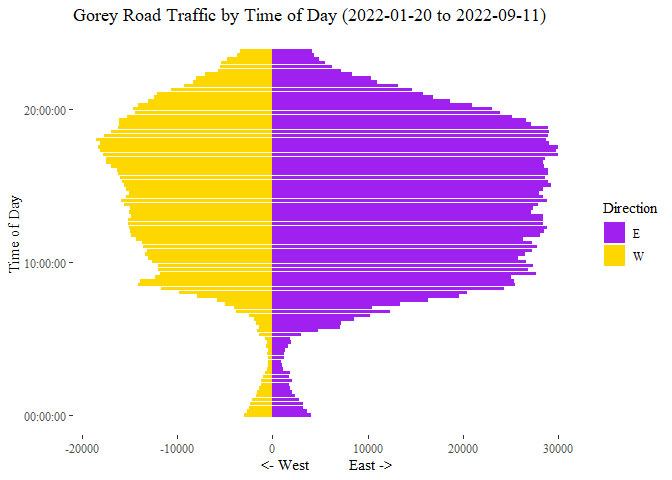
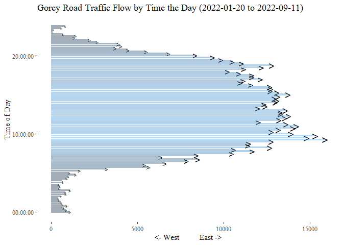
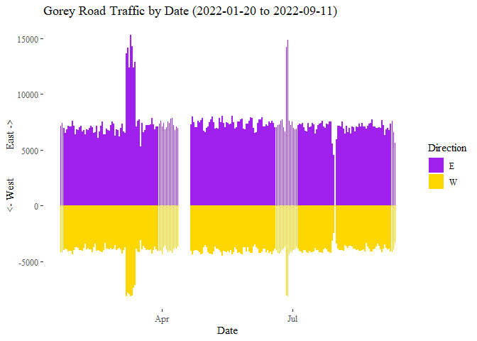

Gorey Traffic Blog
================
Ru Hickson
2022-11-01

## Background

Data sourced at
[data.gov.ie](https://data.gov.ie/dataset/gorey-traffic-data)

Gorey is pretty close to my hometown of Arklow and, for anyone who’s
been through it, you’ll know the town has a pretty notorious history as
a traffic bottleneck (not as bad as Enniscorthy, but still…). So when I
found a large dataset on the inexhaustible data.gov.ie for Gorey Traffic
over the past 9 months or so, I felt compelled to work with it.

``` r
summary(dataset)
```

    ##      Town              County          Street_Name          Sensor_ID    
    ##  Length:22502       Length:22502       Length:22502       Min.   :97898  
    ##  Class :character   Class :character   Class :character   1st Qu.:97898  
    ##  Mode  :character   Mode  :character   Mode  :character   Median :97898  
    ##                                                           Mean   :97898  
    ##                                                           3rd Qu.:97898  
    ##                                                           Max.   :97898  
    ##     Latitude       Longitude          Date               Time          
    ##  Min.   :52.68   Min.   :-6.294   Length:22502       Length:22502      
    ##  1st Qu.:52.68   1st Qu.:-6.294   Class :character   Class :character  
    ##  Median :52.68   Median :-6.294   Mode  :character   Mode  :character  
    ##  Mean   :52.68   Mean   :-6.294                                        
    ##  3rd Qu.:52.68   3rd Qu.:-6.294                                        
    ##  Max.   :52.68   Max.   :-6.294                                        
    ##  Direction_West   Direction_East     Week_Year    
    ##  Min.   :  0.00   Min.   :  0.00   Min.   : 3.00  
    ##  1st Qu.: 10.00   1st Qu.: 18.00   1st Qu.:10.00  
    ##  Median : 47.00   Median : 81.00   Median :20.00  
    ##  Mean   : 41.22   Mean   : 74.08   Mean   :19.59  
    ##  3rd Qu.: 66.00   3rd Qu.:123.00   3rd Qu.:28.00  
    ##  Max.   :146.00   Max.   :183.00   Max.   :36.00

``` r
str(dataset)
```

    ## 'data.frame':    22502 obs. of  11 variables:
    ##  $ Town          : chr  "Gorey" "Gorey" "Gorey" "Gorey" ...
    ##  $ County        : chr  "Wexford" "Wexford" "Wexford" "Wexford" ...
    ##  $ Street_Name   : chr  "Main Street" "Main Street" "Main Street" "Main Street" ...
    ##  $ Sensor_ID     : int  97898 97898 97898 97898 97898 97898 97898 97898 97898 97898 ...
    ##  $ Latitude      : num  52.7 52.7 52.7 52.7 52.7 ...
    ##  $ Longitude     : num  -6.29 -6.29 -6.29 -6.29 -6.29 ...
    ##  $ Date          : chr  "2022-03-07" "2022-03-07" "2022-03-07" "2022-03-07" ...
    ##  $ Time          : chr  "00:00:34" "00:15:21" "00:30:10" "00:45:04" ...
    ##  $ Direction_West: int  4 6 5 3 5 3 2 2 1 1 ...
    ##  $ Direction_East: int  10 11 7 6 5 2 2 2 0 4 ...
    ##  $ Week_Year     : int  10 10 10 10 10 10 10 10 10 10 ...

``` r
head(dataset)
```

    ##    Town  County Street_Name Sensor_ID Latitude Longitude       Date     Time
    ## 1 Gorey Wexford Main Street     97898 52.67579  -6.29403 2022-03-07 00:00:34
    ## 2 Gorey Wexford Main Street     97898 52.67579  -6.29403 2022-03-07 00:15:21
    ## 3 Gorey Wexford Main Street     97898 52.67579  -6.29403 2022-03-07 00:30:10
    ## 4 Gorey Wexford Main Street     97898 52.67579  -6.29403 2022-03-07 00:45:04
    ## 5 Gorey Wexford Main Street     97898 52.67579  -6.29403 2022-03-07 01:00:05
    ## 6 Gorey Wexford Main Street     97898 52.67579  -6.29403 2022-03-07 01:15:12
    ##   Direction_West Direction_East Week_Year
    ## 1              4             10        10
    ## 2              6             11        10
    ## 3              5              7        10
    ## 4              3              6        10
    ## 5              5              5        10
    ## 6              3              2        10

## Managing the Data

There’s a wee bit of redundant data here we don’t particularly need. In
fact, everything from the first 6 fields only has a single value. What I
want to look at is the volume of Eastbound and Westbound traffic
throughout the year, and really throughout the day.

``` r
# create workable subset
dataset_mini <- dataset[,c("Date","Time","Direction_West","Direction_East")]
```

I’m also interested in rounding the data to the nearest 15 minutes. Just
a casual browse through the Time field shows there’s no particularly
consistent pattern like “top of the minute”. This step isn’t strictly
necessary, but it buckets the data nicely. For convenience, I’m also
going to create a timestamp field called datetime

``` r
# handle datetime and round to nearest 15 minutes
dataset_mini$Datetime <- as.POSIXct(as.character(paste(dataset_mini$Date, dataset_mini$Time)))
dataset_mini$Datetime <- round_date(dataset_mini$Datetime, "15 minutes")
dataset_mini$Time <- as_hms(dataset_mini$Datetime)

# view new dataset
head(dataset_mini)
```

    ##         Date     Time Direction_West Direction_East            Datetime
    ## 1 2022-03-07 00:00:00              4             10 2022-03-07 00:00:00
    ## 2 2022-03-07 00:15:00              6             11 2022-03-07 00:15:00
    ## 3 2022-03-07 00:30:00              5              7 2022-03-07 00:30:00
    ## 4 2022-03-07 00:45:00              3              6 2022-03-07 00:45:00
    ## 5 2022-03-07 01:00:00              5              5 2022-03-07 01:00:00
    ## 6 2022-03-07 01:15:00              3              2 2022-03-07 01:15:00

Often, the output of a visualisation is less interesting than the data
manipulation techniques. Lubridate is an incredible library that
genuinely makes date conversion simple. As a “data guy”, and for any
other data people out there, you’ll know that manipulating time data is
the single most common pain in the whole of analytics. Being able to
convert one date to another so easily is a godsend. And the solution is
so simple, without needing to know explicit format names like ISO8601.
You just tell the function what the date format looks like now, and what
you want it to look like after execution. If you’re lazy, you can even
get it to guess what the starting format is. This sort of feature is
sorely missing from any SQL system I’ve ever used.

## Plotting Time of Day

``` r
# Get start and end dates for dynamic titling
stdate <- min(dataset_mini$Date)
endate <- max(dataset_mini$Date)

# Create time-series dataset
timedata <- dataset_mini %>%
  group_by(Time) %>%
  summarise(W = sum(Direction_West), E = -sum(Direction_East)) %>% 
  as.data.frame()

# Reshape data from wide to long
timedata1 <- timedata %>% gather(., key=Direction, value=no_of_cars, c("W","E"))
timedata1$Time <- as_hms(timedata1$Time)

# Plot time-series
ggplot(timedata1) +
  geom_col(aes(x=Time, y=-no_of_cars, fill=Direction)) +
  theme_tufte() +
  labs(title = paste0("Gorey Road Traffic by Time of Day (",stdate," to ",endate,")")) +
  xlab("Time of Day") +
  ylab("<- West          East ->") +
  coord_flip() +
  scale_fill_manual(values = c("purple","gold"))
```

<!-- -->

I changed from the default ggplot colours to the Wexford county colours
(which are pretty nice), and it’s clear to see traffic is definitely
heavier going East than West. Seems like most people that go East on
Gorey’s Main Street don’t want to go back! In fact, if you’re travelling
East on Gorey’s Main Street, it means you’re on the way to Dublin. There
are also two major arteries at the East end of Main Street, and in some
return cases, it’s simpler to loop back West via a different road than
to go back down the main street. As far as I’m aware, there’s no
Shapefile for Gorey, but as soon as there is one available, I’ll happily
visualize that logic. For now, you can see the general flow on Google
Maps.

Speaking of Flow, let’s take a look at the East vs West flow in Gorey:

``` r
# Calculate E-W Flow throughout the day
timedata$Flow <- timedata$W + timedata$E

# Create Flow time-series dataset
ggplot(timedata) +
  geom_text(aes(x=Time, y=-Flow, size = -Flow), label = ">") +
  geom_col(aes(x=Time, y=-Flow, fill=-Flow), alpha=.4) +
  theme_tufte() +
  labs(title = paste0("Gorey Road Traffic Flow by Time the Day (",stdate," to ",endate,")")) +
  xlab("Time of Day") +
  ylab("<- West          East ->") +
  coord_flip() +
  theme(legend.position = "none")
```

<!-- -->

Wow! So a pretty heavy Eastbound bias indeed - there’s no point in the
day where Westbound traffic is actually heavier.

But does this pattern hold true for Day as well as time? Let’s see.

## Plotting Dates

``` r
# create time-series dataset
datedata <- dataset_mini %>%
  group_by(Date) %>%
  summarise(W = sum(Direction_West), E = -sum(Direction_East)) %>% 
  as.data.frame()

# reshape data from wide to long
datedata1 <- datedata %>% gather(., key=Direction, value=no_of_cars, c("W","E"))
datedata1$Date <- as_date(datedata1$Date)
str(datedata1)
```

    ## 'data.frame':    454 obs. of  3 variables:
    ##  $ Date      : Date, format: "2022-01-20" "2022-01-21" ...
    ##  $ Direction : chr  "W" "W" "W" "W" ...
    ##  $ no_of_cars: int  4140 4197 3949 3858 3913 4090 4063 4062 4365 4007 ...

``` r
# plot time-series
ggplot(datedata1) +
  geom_col(aes(x=Date, y=-no_of_cars, fill=Direction)) +
  theme_tufte() +
  labs(title = paste0("Gorey Road Traffic by Date (",stdate," to ",endate,")")) +
  xlab("Date") +
  ylab("<- West          East ->") +
  scale_fill_manual(values = c("purple","gold"))
```

<!-- -->

Looks pretty similar as well. It’s clear the average Eastbound traffic
is \~7500 per day, while Eastbound barely touches \~5000.

There are some interesting anomalies in the data.

The large spike for the week beginning 6th March is likely down to the
week Ireland began receiving large numbers of Ukranian refugees as a
result of the ongoing war
[Source](https://www.google.com/search?q=ireland&biw=1490&bih=746&sxsrf=ALiCzsY80uvODo64cg74lfBJHi0BQl_qsw%3A1667405656824&source=lnt&tbs=cdr%3A1%2Ccd_min%3A3%2F1%2F2022%2Ccd_max%3A3%2F6%2F2022&tbm=nws).
Many of these refugees would have come in from Rosslare and travelled up
to Dublin. Coincidentally, this is also the date Ireland dropped its
requirement for tourists to have a Covid vaccination cerification to
enter the country.

There is no explanation given for the 8-day gap in April (13-20), so
it’s possible the sensors were down for maintenance or some other
reason.

The large spikes on the 26th and 27th of June are most likely due to
people travelling for [Wexford Pride](https://linktr.ee/wexfordpride)
that weekend.

And the miniscule value on the 31st of July is as a result of the [Gorey
Market House
Festival](https://lovegorey.ie/event/2022-gorey-market-house-festival),
where the main street was closed while pedestrians flooded the streets
and enjoyed the summer weather.

## Thanks

If you liked reading this, please give me a follow on
[LinkedIn](http://linkedin.com/in/ruhickson) or
[Twitter](https://twitter.com/ruhickson) or
[Github](https://github.com/ruhickson) for more content!
